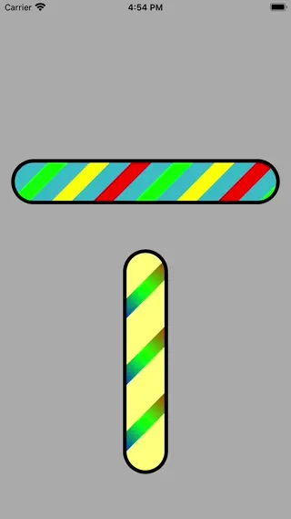

# WWBarberPoleView

[](https://developer.apple.com/swift/) [](https://developer.apple.com/swift/)  [](https://developer.apple.com/swift/) [](https://developer.apple.com/swift/)

### [Introduction - 簡介](https://swiftpackageindex.com/William-Weng)
- [Imitate the animation effect of barber's pole.](https://zh.wikipedia.org/zh-tw/三色柱)
- [模仿三色柱的動畫效果。](https://landpattern2630.wixsite.com/landpattern/copy-of-design-3)



### [Installation with Swift Package Manager](https://medium.com/彼得潘的-swift-ios-app-開發問題解答集/使用-spm-安裝第三方套件-xcode-11-新功能-2c4ffcf85b4b)
```bash
dependencies: [
    .package(url: "https://github.com/William-Weng/WWBarberPoleView.git", .upToNextMajor(from: "1.1.0"))
]
```

### [Function - 可用函式](https://ezgif.com/video-to-webp)
|函式|功能|
|-|-|
|start(direction:rule:duration:width:spacing:colors:)|開始執行|

### Example
```swift
import UIKit
import WWBarberPoleView

final class ViewController: UIViewController {
    
    @IBOutlet weak var barberPoleView1: WWBarberPoleView!
    @IBOutlet weak var barberPoleView2: WWBarberPoleView!

    override func viewDidLoad() {
        super.viewDidLoad()
        demo1()
        demo2()
    }
}

private extension ViewController {
    
    func demo1() {
        barberPoleView1.layer.borderWidth = 5
        barberPoleView1.layer.borderColor = UIColor.black.cgColor
        barberPoleView1.start()
    }
    
    func demo2() {
        barberPoleView2.layer.borderWidth = 5
        barberPoleView2.layer.borderColor = UIColor.black.cgColor
        barberPoleView2.start(direction: .down, colors: [.red])
    }
}
```
